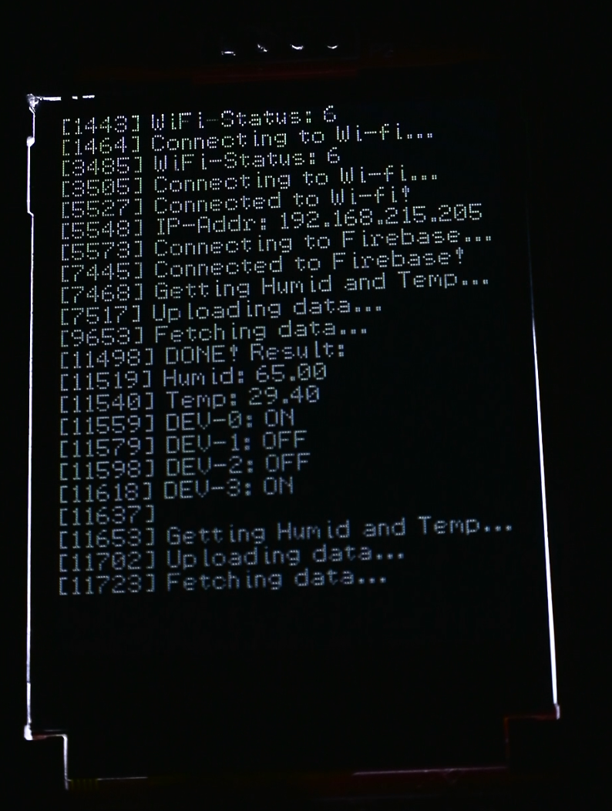

# ```console``` for TFT 2.2" ILI9225 screen with esp32

Too lazy too write anything...

## Note

- This code has been written and compiled in Ubuntu 24.04.

## Features

- Wrap text
- Show time from `millis()`
- Only send to show changed pixels
- :v

## Review


